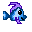

# Stay Off the Line! Remastered

## Overview

A port/enhanced version of [the original Stay Off the Line!](https://github.com/nhaney/stayOffTheLine) game
I made for the 2018 [js13k](https://js13kgames.com/) game jam.

This game is written using Rust using the [Bevy game engine](https://github.com/bevyengine/bevy).

Play a WASM build of this game on your browser [here](https://nigelhaney.com/fish-game).

## Development

Development of this game is done using `nix`. To enter the development shell, use `nix develop` or the `direnv` tool.

The flake outputs a package that is the native linux build using `nix build` and a WASM build using `nix build .#wasm`.

If you hack around on the game and do something cool, feel free to open a PR!

## Road map

Below is an unsorted list of the next things that I want to accomplish on this project in no particular order:

- [ ] Implement a fixed timestep for game logic, and a normal timestep for rendering
- [ ] Implement an online leaderboard with server-side validation of score using a headless build
- [ ] Improve graphics/gameplay mechanics

